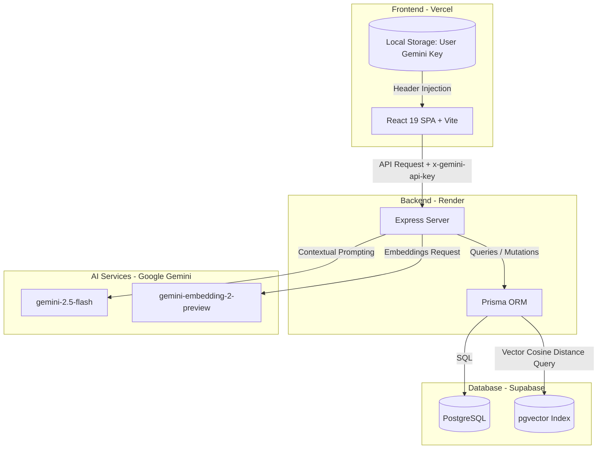
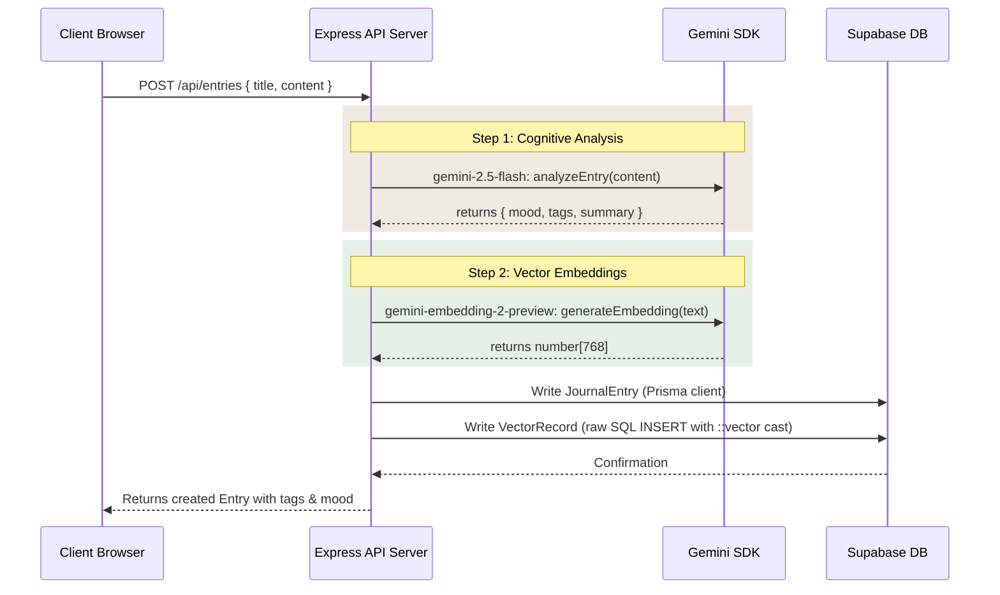
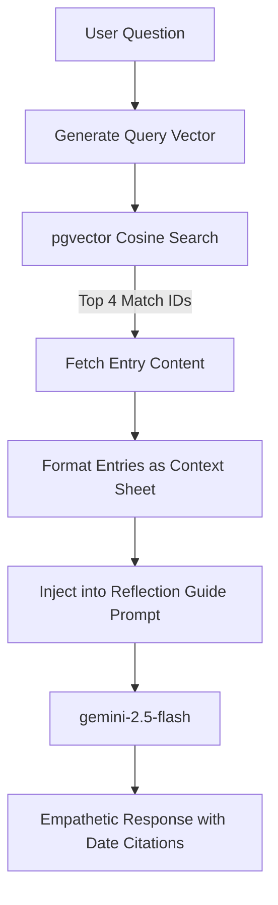
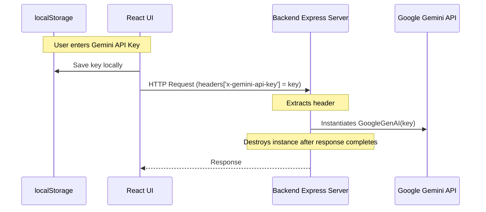

# Haven Journal 📖🌱

**Haven Journal** is a cozy, private, and mindful digital sanctuary designed for self-reflection and personal growth. By combining an intimate, warm user interface with modern retrieval-augmented generation (RAG) and vector similarity search, it allows you to chronicle your life, explore recurring emotional patterns, and hold gentle conversations with your past pages.

This document provides a comprehensive overview of how Haven Journal is architected, its tech stack, database design, and the under-the-hood workflows that power its intelligence.

---

## 🛠️ The Tech Stack

Haven Journal is built as a fully decoupled client-server web application.



### 1. Frontend Client
* **Core Framework**: [React 19](https://react.dev/) and [TypeScript](https://www.typescriptlang.org/) managed via [Vite](https://vite.dev/) as a lightning-fast Single Page Application (SPA).
* **Styling & Theme**: [Tailwind CSS v4](https://tailwindcss.com/) for fluid responsive layout design, incorporating soft pastel warm-paper palettes, glassmorphism elements, custom micro-interactions, and editorial serif typography to convey a comforting, offline-journal aesthetic.
* **Iconography**: [Lucide React](https://lucide.dev/) for a clean, consistent, and organic set of icons.

### 2. Backend API
* **Runtime**: [Node.js](https://nodejs.org/) & [Express](https://expressjs.com/) with TypeScript compilation via `tsx`.
* **Database Access**: [Prisma Client v5.22.0](https://www.prisma.io/) to orchestrate relational database queries and PostgreSQL operations.
* **Security & Auth**:
  - Stateless **JSON Web Tokens (JWT)** (`jsonwebtoken`) for secure, stateless sessions.
  - **bcryptjs** for hashing and salting user passwords.
  - **CORS** middleware to restrict API traffic to authorized client origins.

### 3. Database & Vector Index
* **Relational Store**: [PostgreSQL (Supabase)](https://supabase.com/) hosting tables for user authentication and diary metadata.
* **Vector Database**: PostgreSQL `pgvector` extension for storing and performing high-performance similarity calculations on 768-dimensional embedding vectors.

### 4. Intelligence & Embeddings
* **Text Synthesis**: [Google Gemini 2.5 Flash](https://ai.google.dev/) via the official `@google/genai` SDK for mood classification, tag extraction, chat responses, and weekly insights.
* **Vector Embeddings**: `gemini-embedding-2-preview` to compile text content into multidimensional semantic coordinates.

---

## 🗄️ Database Schema Design

The application's relational data model is defined in Prisma (`prisma/schema.prisma`) and runs on top of a PostgreSQL instance equipped with the `pgvector` extension.

```mermaid
erDiagram
    USER ||--o{ JOURNAL-ENTRY : "writes"
    JOURNAL-ENTRY ||--|| VECTOR-RECORD : "indexed in"

    USER {
        string id PK
        string email UNIQUE
        string passwordHash
        DateTime createdAt
    }

    JOURNAL-ENTRY {
        string id PK
        string userId FK
        string title
        string content TEXT
        string mood
        string[] tags
        DateTime createdAt
        DateTime updatedAt
    }

    VECTOR-RECORD {
        string id PK
        string entryId FK
        string userId FK
        vector_768 vector "pgvector (Unsupported)"
        DateTime createdAt
    }
```

### Prisma Schema Definition

```prisma
datasource db {
  provider = "postgresql"
  url      = env("DATABASE_URL")
}

generator client {
  provider = "prisma-client-js"
}

model User {
  id           String         @id @default(uuid())
  email        String         @unique
  passwordHash String
  createdAt    DateTime       @default(now())
  entries      JournalEntry[]
}

model JournalEntry {
  id        String        @id @default(uuid())
  userId    String
  user      User          @relation(fields: [userId], references: [id], onDelete: Cascade)
  title     String
  content   String        @db.Text
  mood      String
  tags      String[]
  createdAt DateTime      @default(now())
  updatedAt DateTime      @updatedAt
  vectors   VectorRecord[]
}

model VectorRecord {
  id        String       @id @default(uuid())
  entryId   String
  entry     JournalEntry @relation(fields: [entryId], references: [id], onDelete: Cascade)
  userId    String
  vector    Unsupported("vector(768)")?
  createdAt DateTime     @default(now())
}
```

> [!NOTE]
> Since Prisma does not natively support the PostgreSQL `vector` data type, the `VectorRecord.vector` field is mapped as `Unsupported("vector(768)")`. Writing and querying vector data is performed bypass-style using raw SQL transactions (`prisma.$queryRaw` and `prisma.$executeRaw`).

---

## 🔍 How It Works: Under the Hood

### 1. Inscribe & Reflect (Journal Entry Creation Flow)

When you write a journal entry and click **Save**, the backend processes the entry through a multi-step pipeline:



* **Cognitive Analysis**: The `gemini-2.5-flash` model parses the entry text. Using structured JSON Schema enforcement (`responseMimeType: 'application/json'`), it extracts the primary mood (e.g., *peaceful*, *joyful*, *anxious*) and generates 2-4 mindful tags.
* **Vector Embedding**: The title and entry content are combined and converted into a 768-dimensional embedding vector representing the semantic "essence" of your day.

---

### 2. Echoes of the Heart (Semantic Memory Search)

Instead of searching for raw keywords (which fail to capture emotional context), Haven Journal searches for entries based on semantic similarity.

1. The search query (e.g., *"feeling lost but hoping for a new start"*) is sent to `gemini-embedding-2-preview` to generate a 768-dimensional query vector.
2. The server executes a cosine similarity search against the `VectorRecord` table using pgvector's cosine distance operator (`<=>`).
3. Cosine similarity score is calculated as `1 - CosineDistance`:

```typescript
async findTopSimilar(userId: string, targetVector: number[], topK = 5) {
  const vectorString = `[${targetVector.join(',')}]`;

  // Cosine distance <=> yields 0 for exact match, 2 for opposite.
  // 1 - distance gives us a similarity score between 0 and 1.
  const results = await prisma.$queryRaw<Array<{ entryId: string; score: number }>>`
    SELECT "entryId", (1 - (vector <=> ${vectorString}::vector)) AS "score"
    FROM "VectorRecord"
    WHERE "userId" = ${userId}
    ORDER BY vector <=> ${vectorString}::vector ASC
    LIMIT ${topK}
  `;

  return results.map(r => ({
    entryId: r.entryId,
    score: Number(r.score)
  }));
}
```

---

### 3. Conversations with Past Pages (Retrieval-Augmented Generation / RAG)

The Reflection Guide allows you to speak directly with your history (e.g. *"What made me happy last month?"* or *"Have I been sticking to my sleep goals?"*).



* **Context Constraints**: The system prompt strictly binds Gemini to the retrieved entries:
  > *"You are a warm, highly intuitive, and loving Reflection Guide for 'Haven Journal'... Using ONLY the provided context entries from their past, answer their query with deep emotional alignment... Always cite the dates of the entries you are referencing. If the entries do not contain the answer, say so gently."*
* **Security**: The LLM only sees the top 4 entries related to your question. It never exposes your complete journal database.

---

### 4. Garden Insights (Weekly Analytics & Summaries)

The **Weekly Garden** compiles your emotional trajectory over the last 7 days.

* **Quantitative Aggregations**: The backend calculates mood frequencies and tags using database aggregation.
* **Qualitative Growth Synthesis**: The full text of the week's journal entries is sent to `gemini-2.5-flash`. The model reviews the week's trajectory, outlines recurring themes (e.g., sleep issues, gratitude, work pressure), and generates 3 customized, gentle personal growth guidelines.

---

## 🔒 Sanctuary Settings & Key Architecture

To preserve security and make the application completely free and open, Haven Journal supports localized API key authorization.



* **Zero Backend Key Storage**: The database does not have an API key column.
* **Browser Sandbox**: The user's key resides exclusively in their browser's secure `localStorage`.
* **Isolated Instances**: On every incoming API request, the server extracts the `x-gemini-api-key` header and initializes an ephemeral `GoogleGenAI` instance. This instance is garbage-collected once the request finishes, leaving zero footprint.
