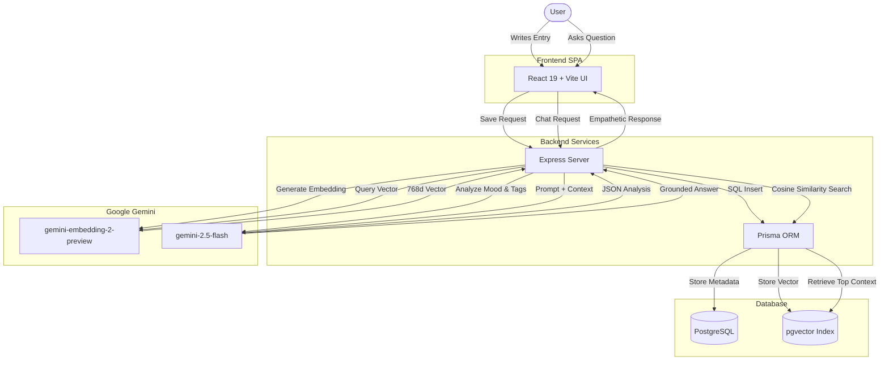
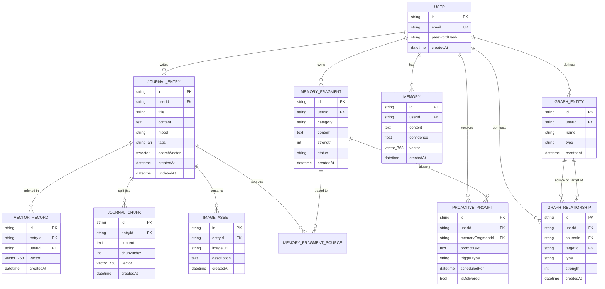
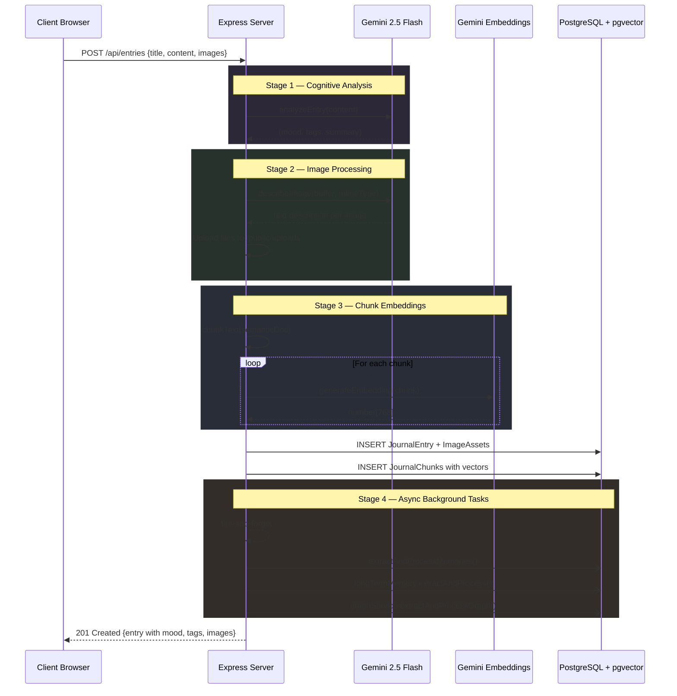
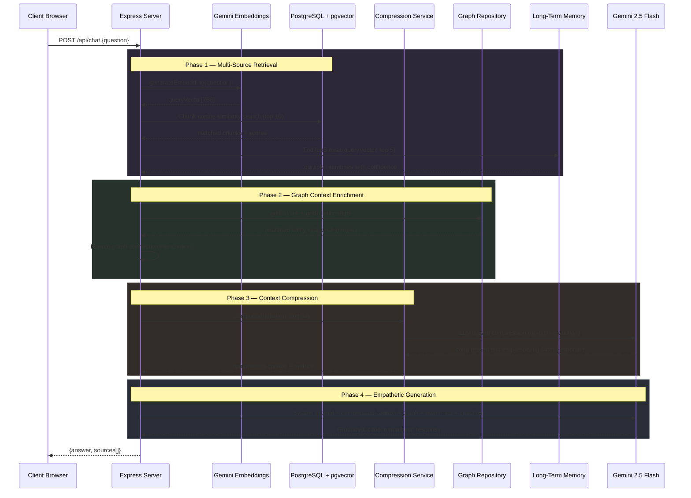
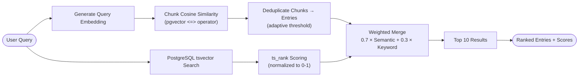
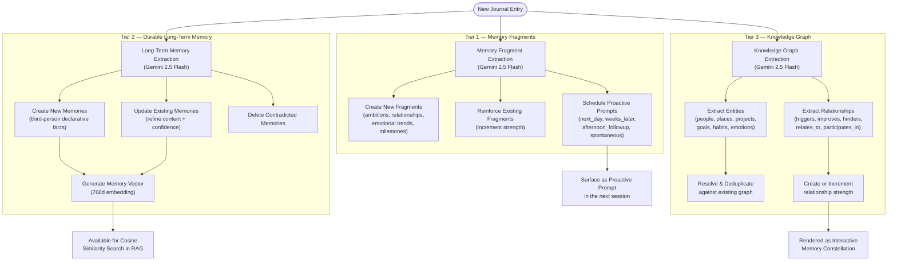
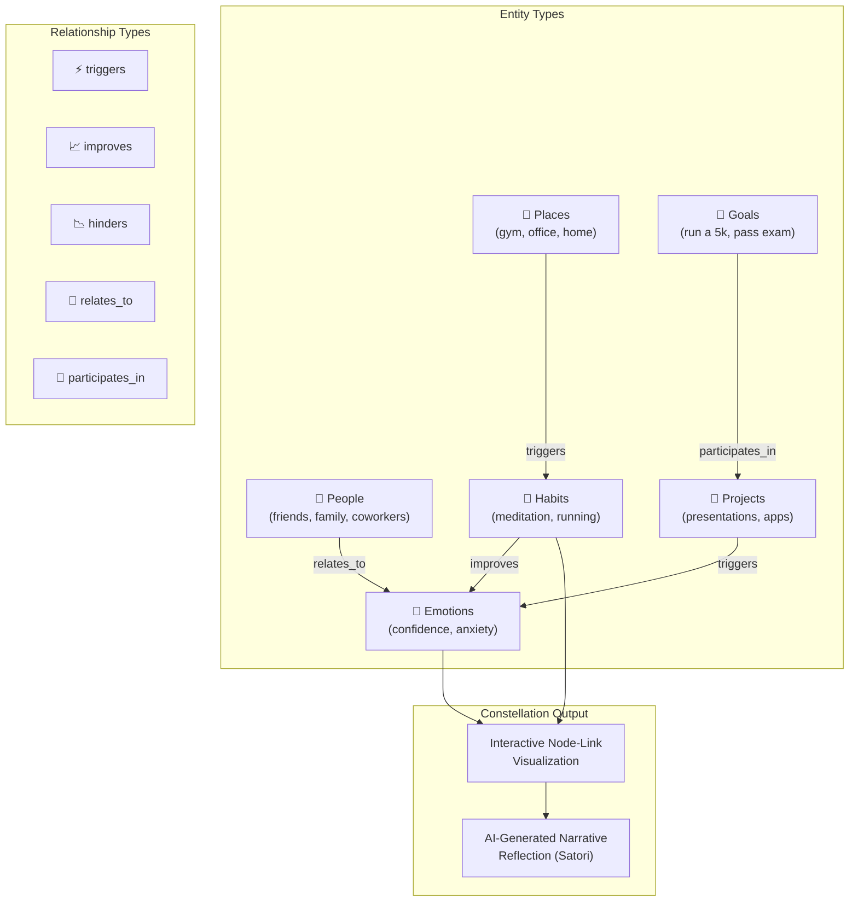
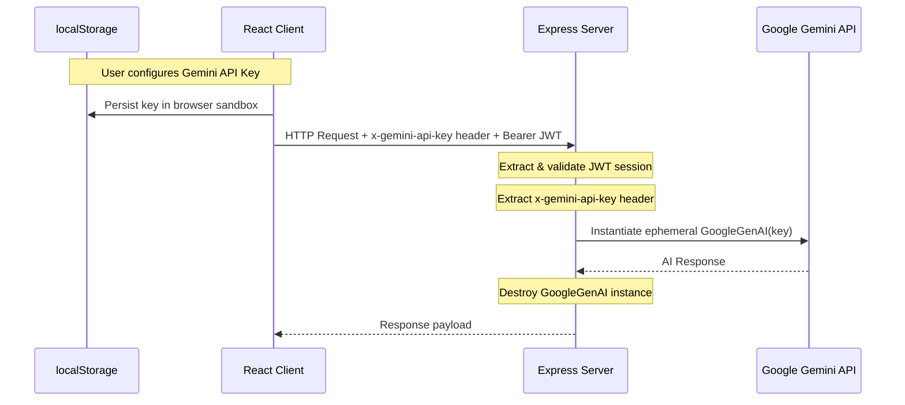

  <h1>Solace Diaries 🌱</h1>
  
<strong>A mindful, AI-powered digital sanctuary for self-reflection and personal growth.</strong>

  

    
    
    
    
    
    
    
  

 

## 📖 Project Overview

**Solace Diaries** is not just another note-taking application—it is a private, intelligent sanctuary designed for emotional reflection and long-term personal growth. 

Traditional journaling often becomes a disconnected archive of thoughts, making it difficult to uncover emotional patterns or reconnect with past insights. Solace Diaries bridges this gap by transforming your daily entries into a living, interactive memory system. 

Powered by **Google Gemini 2.5 Flash** and semantic vector embeddings, Solace Diaries deeply understands the emotional context of your writing. It acts as an empathetic Reflection Guide, enabling you to converse with your past, identify recurring themes, and achieve a deeper level of self-awareness.

## ✨ Key Features

Solace Diaries brings your journal to life with a suite of advanced AI and memory capabilities:

- **✍️ AI-Powered Journaling:** Automatically analyzes your entries to extract your primary mood, generate mindful tags, and synthesize daily reflections.
- **🧠 Semantic Memory Retrieval:** Unlike basic keyword search, Solace Diaries leverages `pgvector` and Gemini embeddings to find past entries that share the same *emotional essence* and semantic context.
- **💬 Reflection Guide Chat:** Hold empathetic, context-aware conversations with your past pages using advanced Retrieval-Augmented Generation (RAG). Ask your journal, *"What made me happy last month?"* or *"Have I been sticking to my goals?"*
- **🔄 Context-Aware Conversations:** The AI strictly binds to your retrieved entries, providing grounded, cited responses based purely on your lived experiences.
- **🖼️ Image-Enhanced Memories:** Attach photos and visual memories to your entries via `multer` integration, creating a richer, multi-modal journaling experience.
- **🕰️ Long-Term Memory Capabilities:** Your entries are continuously compiled into multi-dimensional semantic coordinates, creating a growing, queryable map of your emotional journey over time.
- **📊 Mood Analysis & Weekly Garden:** Visualizes your emotional trajectory over the week and generates customized, gentle personal growth guidelines based on your most recent themes.

## 🏗️ System Architecture

Solace Diaries is built as a fully decoupled, production-grade web application. It leverages a modern TypeScript stack, ensuring type safety from the React client down to the PostgreSQL database.

The intelligence layer combines the speed of the **Gemini 2.5 Flash** model for text synthesis and cognitive analysis with **gemini-embedding-2-preview** for high-performance semantic coordinate mapping.

### High-Level Flow

```mermaid
flowchart TD
    %% Define Nodes
    User([User])
    
    subgraph Client [Frontend SPA]
        UI[React 19 + Vite UI]
    end
    
    subgraph API [Backend Services]
        Server[Express Server]
        Prisma[Prisma ORM]
    end
    
    subgraph Storage [Database]
        DB[(PostgreSQL)]
        VectorDB[(pgvector Index)]
    end
    
    subgraph Intelligence [Google Gemini]
        Embeddings[gemini-embedding-2-preview]
        Gemini[gemini-2.5-flash]
    end

    %% Journaling Flow
    User -->|Writes Entry| UI
    UI -->|Save Request| Server
    Server -->|Generate Embedding| Embeddings
    Server -->|Analyze Mood & Tags| Gemini
    Embeddings -->|768d Vector| Server
    Gemini -->|JSON Analysis| Server
    Server -->|SQL Insert| Prisma
    Prisma -->|Store Metadata| DB
    Prisma -->|Store Vector| VectorDB
    
    %% RAG Chat Flow
    User -->|Asks Question| UI
    UI -->|Chat Request| Server
    Server -->|Query Vector| Embeddings
    Server -->|Cosine Similarity Search| Prisma
    Prisma -->|Retrieve Top Context| VectorDB
    Server -->|Prompt + Context| Gemini
    Gemini -->|Grounded Answer| Server
    Server -->|Empathetic Response| UI
```

### Architecture Components

1. **Client Frontend:** A blazing-fast Single Page Application (SPA) built with **React 19**, **Vite**, and **Tailwind CSS v4**. It features an intimate, warm user interface with glassmorphism elements, custom micro-interactions, and offline-journal aesthetics.
2. **Backend Services:** A stateless **Node.js/Express** API that orchestrates embedding generation, semantic searches, and cognitive analysis. Includes robust handling for multipart/form-data image uploads.
3. **Data & Vector Storage:** **Supabase (PostgreSQL)** serves as the primary data store. The `pgvector` extension empowers lightning-fast cosine similarity searches over 768-dimensional embeddings via raw SQL transactions.
4. **AI Intelligence:** Powered by **Google Gemini**. Text analysis, mood extraction, and empathetic RAG chat are handled by `gemini-2.5-flash`, while the semantic coordinate mapping relies on `gemini-embedding-2-preview`.

---

## 🗄️ Database Schema

The data model is defined in Prisma and runs on PostgreSQL with the `pgvector` extension. The schema captures journal entries, chunked embeddings, image assets, memory fragments, long-term memories, and a full knowledge graph.

```mermaid
erDiagram
    USER ||--o{ JOURNAL_ENTRY : "writes"
    USER ||--o{ MEMORY_FRAGMENT : "owns"
    USER ||--o{ MEMORY : "has"
    USER ||--o{ GRAPH_ENTITY : "defines"
    USER ||--o{ GRAPH_RELATIONSHIP : "connects"
    USER ||--o{ PROACTIVE_PROMPT : "receives"

    JOURNAL_ENTRY ||--o{ VECTOR_RECORD : "indexed in"
    JOURNAL_ENTRY ||--o{ JOURNAL_CHUNK : "split into"
    JOURNAL_ENTRY ||--o{ IMAGE_ASSET : "contains"
    JOURNAL_ENTRY ||--o{ MEMORY_FRAGMENT_SOURCE : "sources"

    MEMORY_FRAGMENT ||--o{ MEMORY_FRAGMENT_SOURCE : "traced to"
    MEMORY_FRAGMENT ||--o{ PROACTIVE_PROMPT : "triggers"

    GRAPH_ENTITY ||--o{ GRAPH_RELATIONSHIP : "source of"
    GRAPH_ENTITY ||--o{ GRAPH_RELATIONSHIP : "target of"

    USER {
        string id PK
        string email UK
        string passwordHash
        datetime createdAt
    }

    JOURNAL_ENTRY {
        string id PK
        string userId FK
        string title
        text content
        string mood
        string_arr tags
        tsvector searchVector
        datetime createdAt
        datetime updatedAt
    }

    JOURNAL_CHUNK {
        string id PK
        string entryId FK
        text content
        int chunkIndex
        vector_768 vector
        datetime createdAt
    }

    IMAGE_ASSET {
        string id PK
        string entryId FK
        string imageUrl
        text description
        datetime createdAt
    }

    VECTOR_RECORD {
        string id PK
        string entryId FK
        string userId FK
        vector_768 vector
        datetime createdAt
    }

    MEMORY_FRAGMENT {
        string id PK
        string userId FK
        string category
        text content
        int strength
        string status
        datetime createdAt
    }

    MEMORY {
        string id PK
        string userId FK
        text content
        float confidence
        vector_768 vector
        datetime createdAt
    }

    GRAPH_ENTITY {
        string id PK
        string userId FK
        string name
        string type
        datetime createdAt
    }

    GRAPH_RELATIONSHIP {
        string id PK
        string userId FK
        string sourceId FK
        string targetId FK
        string type
        int strength
        datetime createdAt
    }

    PROACTIVE_PROMPT {
        string id PK
        string userId FK
        string memoryFragmentId FK
        text promptText
        string triggerType
        datetime scheduledFor
        bool isDelivered
    }
```

> **Note:** Since Prisma does not natively support the PostgreSQL `vector` data type, `vector(768)` fields are mapped as `Unsupported` and all vector I/O uses raw SQL (`$queryRaw` / `$executeRaw`).

---

## 🔍 Under the Hood: Data Pipelines

### 1. Journal Entry Creation Pipeline

When a user writes and saves an entry, the backend orchestrates a multi-stage AI processing pipeline before persisting data and spawning asynchronous background tasks.

```mermaid
sequenceDiagram
    participant User as Client Browser
    participant API as Express Server
    participant AI as Gemini 2.5 Flash
    participant Embed as Gemini Embeddings
    participant DB as PostgreSQL + pgvector

    User->>API: POST /api/entries {title, content, images}

    rect rgb(45, 40, 55)
        Note over API,AI: Stage 1 — Cognitive Analysis
        API->>AI: analyzeEntry(content)
        AI-->>API: {mood, tags, summary}
    end

    rect rgb(40, 50, 45)
        Note over API,AI: Stage 2 — Image Processing
        API->>AI: describeImage(buffer, mimeType)
        AI-->>API: text description per image
        API->>API: Upload files to /public/uploads
    end

    rect rgb(40, 45, 55)
        Note over API,Embed: Stage 3 — Chunk Embeddings
        API->>API: chunkText(semanticDoc)
        loop For each chunk
            API->>Embed: generateEmbedding(chunk)
            Embed-->>API: number[768]
        end
    end

    API->>DB: INSERT JournalEntry + ImageAssets
    API->>DB: INSERT JournalChunks with vectors

    rect rgb(50, 45, 40)
        Note over API,DB: Stage 4 — Async Background Tasks
        API-->>API: fire-and-forget
        API-)DB: extractAndProcessMemories()
        API-)DB: longTermMemory.extractAndProcess()
        API-)DB: graphService.extractAndProcessGraph()
    end

    API-->>User: 201 Created {entry with mood, tags, images}
```

**Key details:**
- **Chunking:** Entries are split into overlapping text chunks before embedding, enabling fine-grained RAG retrieval at the paragraph level.
- **Semantic Document:** The title, content, and AI-generated image descriptions are combined into a single semantic document before chunking.
- **Background Processing:** Memory fragment extraction, long-term memory consolidation, and knowledge graph updates all run asynchronously to keep the save response fast.

---

### 2. RAG Chat Pipeline (Reflection Guide)

The Reflection Guide chat uses a multi-source retrieval pipeline that combines chunk-level semantic search, long-term memories, knowledge graph context, and context compression before prompting the LLM.

```mermaid
sequenceDiagram
    participant User as Client Browser
    participant API as Express Server
    participant Embed as Gemini Embeddings
    participant DB as PostgreSQL + pgvector
    participant Compress as Compression Service
    participant Graph as Graph Repository
    participant LTM as Long-Term Memory
    participant AI as Gemini 2.5 Flash

    User->>API: POST /api/chat {question}

    rect rgb(45, 40, 55)
        Note over API,DB: Phase 1 — Multi-Source Retrieval
        API->>Embed: generateEmbedding(question)
        Embed-->>API: queryVector[768]
        API->>DB: Chunk cosine similarity search (top 10)
        DB-->>API: matched chunks + scores
        API->>LTM: findTopSimilar(queryVector, top 5)
        LTM-->>API: durable memories with confidence
    end

    rect rgb(40, 50, 45)
        Note over API,Graph: Phase 2 — Graph Context Enrichment
        API->>Graph: getEntities + getRelationships
        Graph-->>API: matched entity-relationship triples
        API->>API: Format graph connections as context
    end

    rect rgb(50, 45, 40)
        Note over API,Compress: Phase 3 — Context Compression
        API->>Compress: compress(question, entries)
        Compress->>AI: LLM-based compression (60-80% reduction)
        AI-->>Compress: compressed entries preserving facts + emotions
        Compress-->>API: compressed context + metrics
    end

    rect rgb(40, 45, 55)
        Note over API,AI: Phase 4 — Empathetic Generation
        API->>AI: System prompt + compressed context + graph + memories + question
        AI-->>API: Grounded, cited, empathetic response
    end

    API-->>User: {answer, sources[]}
```

**Key details:**
- **Adaptive Threshold:** Only chunks scoring above `max(0.4, bestScore × 0.8)` are included, preventing low-quality noise from diluting context.
- **Context Compression:** A dedicated `ContextCompressionService` reduces token usage by 60-80% while preserving all facts, dates, and emotional tone.
- **Graph Enrichment:** The knowledge graph contributes behavioral trigger/influence relationships (e.g., *"Gym improves Confidence"*) to the LLM context for richer insights.

---

### 3. Hybrid Search Architecture

Search combines semantic vector similarity with PostgreSQL full-text keyword matching for maximum recall.

```mermaid
flowchart LR
    Query([User Query])

    Query --> EmbedQ[Generate Query Embedding]
    Query --> KeywordQ[PostgreSQL tsvector Search]

    EmbedQ --> CosineSim["Chunk Cosine Similarity\n(pgvector <=> operator)"]
    CosineSim --> Dedup["Deduplicate Chunks → Entries\n(adaptive threshold)"]

    KeywordQ --> Rank["ts_rank Scoring\n(normalized to 0-1)"]

    Dedup --> Merge
    Rank --> Merge

    Merge["Weighted Merge\n0.7 × Semantic + 0.3 × Keyword"]
    Merge --> TopK["Top 10 Results"]
    TopK --> Results([Ranked Entries + Scores])
```

---

### 4. Memory Layer Architecture

Solace Diaries maintains three distinct memory tiers that are extracted and updated asynchronously each time a journal entry is saved.

```mermaid
flowchart TD
    Entry([New Journal Entry])

    Entry --> FragExtract["Memory Fragment Extraction\n(Gemini 2.5 Flash)"]
    Entry --> LTMExtract["Long-Term Memory Extraction\n(Gemini 2.5 Flash)"]
    Entry --> GraphExtract["Knowledge Graph Extraction\n(Gemini 2.5 Flash)"]

    subgraph Tier1 ["Tier 1 — Memory Fragments"]
        FragExtract --> NewFrag["Create New Fragments\n(ambitions, relationships,\nemotional trends, milestones)"]
        FragExtract --> UpdateFrag["Reinforce Existing Fragments\n(increment strength)"]
        FragExtract --> Prompts["Schedule Proactive Prompts\n(next_day, weeks_later,\nafternoon_followup, spontaneous)"]
    end

    subgraph Tier2 ["Tier 2 — Durable Long-Term Memory"]
        LTMExtract --> NewMem["Create New Memories\n(third-person declarative facts)"]
        LTMExtract --> UpdateMem["Update Existing Memories\n(refine content + confidence)"]
        LTMExtract --> DeleteMem["Delete Contradicted Memories"]
        NewMem --> MemVec["Generate Memory Vector\n(768d embedding)"]
        UpdateMem --> MemVec
    end

    subgraph Tier3 ["Tier 3 — Knowledge Graph"]
        GraphExtract --> Entities["Extract Entities\n(people, places, projects,\ngoals, habits, emotions)"]
        GraphExtract --> Rels["Extract Relationships\n(triggers, improves, hinders,\nrelates_to, participates_in)"]
        Entities --> Resolve["Resolve & Deduplicate\nagainst existing graph"]
        Rels --> Strength["Create or Increment\nrelationship strength"]
    end

    Prompts --> ProactiveUI["Surface as Proactive Prompt\nin the next session"]
    MemVec --> VectorSearch["Available for Cosine\nSimilarity Search in RAG"]
    Strength --> Constellation["Rendered as Interactive\nMemory Constellation"]
```

| Memory Tier | Storage | Purpose | RAG Integration |
|---|---|---|---|
| **Fragments** | Relational (Prisma) | Track ambitions, relationships, emotional patterns with strength scores | Feeds proactive prompts |
| **Durable Memory** | Relational + pgvector | Persistent declarative facts about the user with confidence and vector embeddings | Cosine similarity search in chat |
| **Knowledge Graph** | Entity-Relationship graph | Maps causal/influence links between people, habits, emotions, goals | Injected into RAG context as behavioral insights |

---

### 5. Knowledge Graph & Constellation

The knowledge graph models the user's inner world as a network of interconnected entities and causal relationships, extracted by an AI "narrative psychologist."

```mermaid
flowchart TD
    subgraph EntityTypes ["Entity Types"]
        People["👤 People\n(friends, family, coworkers)"]
        Places["📍 Places\n(gym, office, home)"]
        Projects["📁 Projects\n(presentations, apps)"]
        Goals["🎯 Goals\n(run a 5k, pass exam)"]
        Habits["🔄 Habits\n(meditation, running)"]
        Emotions["💜 Emotions\n(confidence, anxiety)"]
    end

    subgraph RelTypes ["Relationship Types"]
        Triggers["⚡ triggers"]
        Improves["📈 improves"]
        Hinders["📉 hinders"]
        RelatesTo["🔗 relates_to"]
        ParticipatesIn["🤝 participates_in"]
    end

    Habits -->|improves| Emotions
    Projects -->|triggers| Emotions
    People -->|relates_to| Emotions
    Goals -->|participates_in| Projects
    Places -->|triggers| Habits

    subgraph Output ["Constellation Output"]
        Viz["Interactive Node-Link\nVisualization"]
        Reflect["AI-Generated Narrative\nReflection (Satori)"]
    end

    Emotions --> Viz
    Habits --> Viz
    Viz --> Reflect
```

---

## 🔒 Security Architecture

Solace Diaries uses a zero-trust API key model to keep the application free, open, and private.

```mermaid
sequenceDiagram
    participant LS as localStorage
    participant UI as React Client
    participant API as Express Server
    participant Gemini as Google Gemini API

    Note over UI, LS: User configures Gemini API Key
    UI->>LS: Persist key in browser sandbox
    UI->>API: HTTP Request + x-gemini-api-key header + Bearer JWT
    Note over API: Extract & validate JWT session
    Note over API: Extract x-gemini-api-key header
    API->>Gemini: Instantiate ephemeral GoogleGenAI(key)
    Gemini-->>API: AI Response
    Note over API: Destroy GoogleGenAI instance
    API-->>UI: Response payload
```

| Security Layer | Implementation |
|---|---|
| **Authentication** | Stateless JWT tokens via `jsonwebtoken` |
| **Password Storage** | bcrypt hashing + salting via `bcryptjs` |
| **API Key Isolation** | Zero backend storage — key lives only in `localStorage` and ephemeral request headers |
| **CORS** | Restricted to authorized client origins |
| **Ephemeral AI Instances** | `GoogleGenAI` is instantiated per-request and garbage-collected immediately after |

---

## 📡 API Reference

| Method | Endpoint | Auth | Description |
|---|---|---|---|
| `POST` | `/api/auth/signup` | — | Create a new user account |
| `POST` | `/api/auth/login` | — | Authenticate and receive a JWT |
| `POST` | `/api/auth/logout` | Bearer | Invalidate the current session |
| `GET` | `/api/auth/me` | Bearer | Retrieve current session user |
| `GET` | `/api/entries` | Bearer | List all journal entries |
| `GET` | `/api/entries/:id` | Bearer | Get a single journal entry |
| `POST` | `/api/entries` | Bearer | Create entry (supports `multipart/form-data` images) |
| `PUT` | `/api/entries/:id` | Bearer | Update entry + manage images |
| `DELETE` | `/api/entries/:id` | Bearer | Delete entry and all associated vectors/images |
| `GET` | `/api/search?q=` | Bearer | Hybrid semantic + keyword search |
| `POST` | `/api/chat` | Bearer | RAG-powered Reflection Guide chat |
| `GET` | `/api/insights` | Bearer | Generate weekly growth insights |
| `GET` | `/api/memories/active` | Bearer | List active memory fragments |
| `GET` | `/api/memories/durable` | Bearer | List long-term durable memories |
| `GET` | `/api/memories/graph` | Bearer | Get knowledge graph (nodes + links) |
| `GET` | `/api/memories/reflection` | Bearer | AI-generated graph narrative reflection |
| `GET` | `/api/memories/pending-prompt` | Bearer | Get pending proactive prompt |
| `POST` | `/api/memories/prompt/:id/respond` | Bearer | Respond to a proactive prompt |

---

  this nigga actually builds stuff <3

